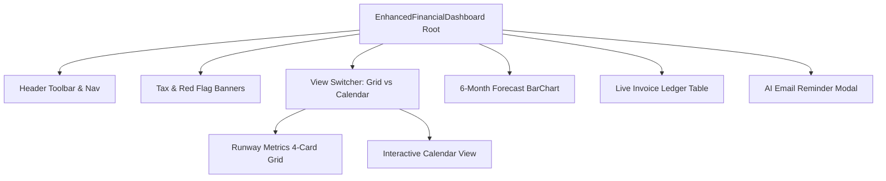

# ZenRunway Financial Engine: Architecture & Operational Breakdown

## 1. Executive Architecture Overview

### Technology Stack & Engineering Foundation
- **Framework**: Next.js 16 (App Router) with TypeScript for full type safety.
- **State & Lifecycle Management**: React 19 core hooks (`useState`, `useMemo`, `useEffect`).
- **Styling Architecture**: Tailwind CSS v4 featuring dynamic glassmorphism (`backdrop-blur-md`, `backdrop-blur-xl`), custom dark canvas (`#0B0F17`), slate card surfaces (`#111622`), sub-containers (`#182030`), and smooth light mode theme mapping (`#F8FAFC` / `#FFFFFF` / `#F1F5F9`).
- **Data Visualization**: Recharts v3 (`ResponsiveContainer`, `BarChart`, `Bar`, `XAxis`, `YAxis`, `Tooltip`, `Cell`, `CartesianGrid`, `ReferenceLine`).
- **Iconography System**: Lucide React vector icons (`Wallet`, `Activity`, `Calendar`, `Sun`, `Moon`, `Mail`, `Repeat`, `AlertTriangle`, `PlusCircle`, `Check`, `X`, `Percent`, `Globe`, `Layers`, `Sparkles`).

### Core Visual & Theme Design
- **Dual Theme Palette System**:
  - **Dark Mode**: Canvas `#0B0F17`, Cards `#111622`, Sub-containers `#182030`, Text `text-slate-100` / `text-slate-400`.
  - **Light Mode**: Canvas `#F8FAFC`, Cards `#FFFFFF`, Sub-containers `#F1F5F9`, Text `text-slate-900` / `text-slate-600`.
- **Clean Typography & Polish**: Pure human-readable subtitle indicators (e.g. `Safe Cash (≥ $30k) in Emerald Green` and `Danger Zone (< $30k) in Rose Red`), eliminating raw technical hex codes from public interface elements.

---

## 2. How the Financial Engine Works (Core Logic & Formulas)

### Runway & Buffer Computations

| Financial Metric | Formula / Logic | Description |
| :--- | :--- | :--- |
| **Daily Burn Rate** | `monthlyBurn / 30` | Baseline daily cash drain rate (`$9,000 / 30 = $300/day`). |
| **Net Settled Income** | `grossReceivedIncome - (isTaxPayerMode ? grossReceivedIncome * 0.15 : 0)` | Net cleared inflow after tax withholding. |
| **Settled Spend Total** | `sum(amount for status in ['paid', 'received'] where type == 'spend')` | Total cleared outgoing expenses. |
| **Liquid Cash** | `baseCheckingBalance ($35,000) + netReceivedIncome - totalSettledSpend` | Settled capital immediately available. |
| **Liquid Days** | `Math.floor(liquidCash / dailyBurnRate)` | Total runway days supported purely by liquid reserves. |
| **Net Pending Receivables** | `grossPendingReceivables - (isTaxPayerMode ? grossPendingReceivables * 0.15 : 0)` | Active, non-overdue incoming payments. |
| **Projected Buffer** | `liquidCash + netPendingReceivables` | Total projected capital including upcoming inflows. |
| **Projected Days** | `Math.floor(projectedBuffer / dailyBurnRate)` | Projected runway days extended by pending inflows. |

### Transaction & Spend Rules
1. **Manual Spend Entries**:
   - Setting transaction type to `'- Spend'` immediately defaults status to `'Paid'`.
   - **Conditional Display**: The `Client Email` input field is completely hidden from view when `- Spend` mode is selected and cleared from form state.
2. **Incoming Payments (`'+ Income'`)**:
   - Setting type to `'+ Income'` defaults status to `'Received'`.
   - Requires a **Mandatory Client Email** (`* Required`), triggering validation errors if omitted (`Client email is required for incoming payment invoices.`).
3. **Recurring Monthly Subscriptions**:
   - Expenses marked as `isSubscription: true` display a dedicated `Sub` badge (`RefreshCw` icon).
   - Clicking **Simulate New Month** automatically resets subscription statuses to `'Pending'` for the new billing cycle.
   - If unpaid past monthly due date (`status === 'pending' && dueDate < todayStr`), they trigger `'Red Flag (Overdue)'` warnings.

### Overdue & Red Flag Risk Audit
- **Condition**: `status === 'pending' && new Date(dueDate) < new Date(todayStr)` (Reference: `2026-08-14`).
- **Risk Exclusion**: Overdue amounts are strictly excluded from liquid cash and safe projected buffer metrics, displaying in the **Red Flags Audit** card and triggering priority notification banners.

---

## 3. How the Interactive Features Work

### Global Currency Conversion ($ USD / Rs PKR)
- **Baseline Storage**: All financial balances and transaction amounts are stored in USD floating point numbers.
- **Conversion Rate**: `$1 USD = 278 PKR`.
- **Dynamic Formatting**:
  - `formatCurrency(val)` formats baseline USD to `$10,000` or `Rs. 2,780,000`.
  - `formatShortCurrency(val)` formats chart axes to `$10k` or `Rs 2.8M`.
  - Input amounts entered in PKR mode are converted back to USD baseline (`numAmt / 278`).

### Tax Payer Mode (15% Withholding Tax)
- **Toggle Mechanism**: Clicking **Tax Mode (15%)** in the header flips `isTaxPayerMode` state.
- **Calculation**: Automatically retains 15% (`TAX_WITHHOLDING_RATE = 0.15`) from gross settled income and pending receivables, updating liquid runway, projected runway, and forecast charts in real time.

### One-Click AI Email Reminder System
1. **Trigger**: Click **AI Reminder** / **AI Email** on any overdue invoice row or red flag banner.
2. **Drafting Engine**: Populates recipient email (`clientEmail`), invoice number (`#TX-104`), overdue duration, and payment instructions into an editable modal draft.
3. **One-Click Send**:
   - **Copy Draft**: Copies raw subject + body to clipboard via `navigator.clipboard.writeText`.
   - **Send Reminder Email**: Opens native mail client (`mailto:recipient?subject=...&body=...`) using `window.open`.

### Calendar View & Theme Switcher
- **Calendar View**:
  - Toggling `Calendar View` switches the primary container from 4-card grid to a full monthly calendar (35/42 day cells).
  - Displays day-by-day badges for income due, subscription renewals, paid expenses, and overdue red flags.
  - Clicking any date cell filters the **Live Invoice Ledger** to display transactions due on that date.
- **Theme Switcher**:
  - Toggling Sun/Moon switches `theme` state (`dark` | `light`).
  - Dynamically updates canvas background, card surfaces, borders, text colors, and Recharts grid lines/axis fills.

---

## 4. Component & Code Module Breakdown

### Module Summary
1. **Header Toolbar**: Holds brand identity, Dark/Light Theme toggle (`Sun`/`Moon`), PKR/USD currency switcher, and 15% Tax Payer mode toggle.
2. **Metrics Grid (4 Cards)**:
   - **Liquid Buffer**: Settled liquid cash, liquid runway days, base checking breakdown.
   - **Projected Buffer**: Projected capital including pending receivables, extended runway days.
   - **Red Flags Audit**: Blocked risk capital, overdue item count, AI reminder status.
   - **Transaction Manager**: Form for adding transactions with conditional Client Email display (`Income` mode only) and subscription markers.
3. **Interactive Calendar View**: Grid rendering days of selected month, month navigation, day transaction badges, and date-click filtering.
4. **6-Month Forecast Chart**: Recharts `BarChart` with dynamic threshold bar colors (`COLOR_SAFE` = `#10B981`, `COLOR_DANGER` = `#F43F5E`), reference line at $30k, and theme-adapted tooltips.
5. **Live Invoice Ledger**: Responsive table displaying transactions, status badges (`Received`, `Paid`, `Red Flag`), date filters, AI Email launchers, and row deletion.
6. **AI Email Reminder Modal**: Interactive modal for reviewing and dispatching overdue invoice notice emails.
